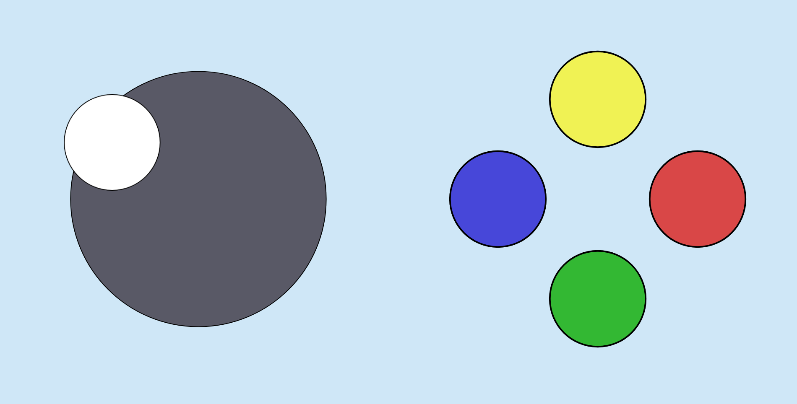
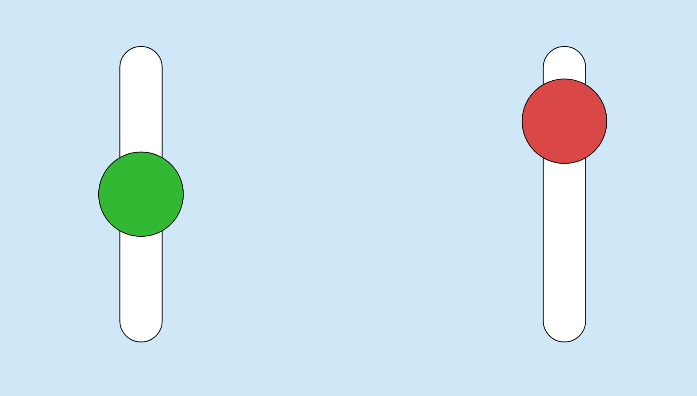

# Monpad

Monpad allows you to use touchscreen devices remotely as inputs to your computer, via a web interface. While initially designed to emulate gamepads, it is highly customisable - for example, you could use it to set up your phone as a wireless keyboard or mouse, or a buzzer for quizzes.

While touchscreen controls are probably too fiddly for particularly serious/complex games, Monpad is ideal for 'party' games, where relatively few buttons/joysticks are required, and the player limit is often much higher than the number of physical controllers one is likely to own.

Some example configurations:





# Build

Prerequisites:

- [Haskell](https://www.haskell.org/):
    - `cabal` ≥ 3.2
    - `ghc` ≥ 8.10.1
- [Elm](https://elm-lang.org/):
    - `elm` ≥ 0.19.1
- `libevdev` headers:
    - Debian/Ubuntu: `sudo apt install libevdev-dev`

If you haven't done so before, run `cabal update` to grab the latest package index from [Hackage](https://hackage.haskell.org/).

Run `./Build.hs` to build. The first time you run this, it could take a while, as `cabal` will need to download and build all dependencies.

# Run

Run `./dist/monpad` to start the server (you can pass the `-h` flag to see all options).

Then connect from your web browser:
- From the same device, you can navigate to eg. `http://localhost:8000/monpad`.
- From another device on the same network, connect with your local ip, instead of `localhost`.
- Allowing connections from an external or unsecured network is strongly discouraged, since no security features are yet implemented.

Note that the `monpad` binary is self-contained - you can move it to any location you wish.

# Customise

The controller layout and button/axis mapping can be fully customised using [Dhall](https://dhall-lang.org/). Examples are [in this repository](https://github.com/georgefst/monpad/tree/master/dhall). Note that some of these files import each other by relative path, so they are best kept together.

# Compatibility / Troubleshooting

## uinput

You will need permissions to write to `/dev/uinput`. This can usually be achieved by creating a group specially for `uinput` permissions:
```bash
sudo groupadd uinput
sudo usermod -a -G uinput $USER
echo 'KERNEL=="uinput", GROUP="uinput", MODE:="0660", OPTIONS+="static_node=uinput"' | sudo tee -a /etc/udev/rules.d/99-uinput.rules > /dev/null
```

Alternatively, you can just run `monpad` as root.

## SDL

The server creates an `evdev` device, via `uinput`, but this in itself is not enough to be picked up by many games. For broad compatibility, you will need to set the `SDL_GAMECONTROLLERCONFIG` environment variable. There are various ways to manage this, such as:

- Set persistently for the current user (you will need to log out and back in for this to take effect):
    ```bash
    echo 'SDL_GAMECONTROLLERCONFIG="000000004d5000004d50000000000000,Monpad,platform:Linux,a:b0,b:b1,x:b3,y:b2,guide:b4,leftx:a0,lefty:a1,"' >> ~/.profile
    ```
- Launch a particular program (in this case Steam) with the variable set locally:
    ```bash
    SDL_GAMECONTROLLERCONFIG="000000004d5000004d50000000000000,Monpad,platform:Linux,a:b0,b:b1,x:b3,y:b2,guide:b4,leftx:a0,lefty:a1," steam
    ```

This should register the gamepad correctly with SDL, Unity, Unreal, Steam etc. Note that the value given above is specific to Monpad's default layout. If using a custom layout, it is recommended that you download the [SDL2 Gamepad Tool](https://generalarcade.com/gamepadtool/), and paste the result of clicking `Copy Mapping String`.

## Browsers

Due to the use of some bleeding-edge Web APIs, at time of writing, the client only really works satisfactorily on Firefox Beta for Android:
- The *pointer events* API is unreliable in Chrome (offsets are reported wrong), and in beta in Firefox.
- Firefox does not currently give permission to switch to fullscreen on a change of rotation.

There is currently no Windows support, but [it's very much on the roadmap](https://github.com/georgefst/monpad/issues/5).

# Contributing

Get involved! I'm particularly looking for someone who's keen on adding Windows support, since I don't currently have a Windows PC to test on.

Note that a basic version of the server (which doesn't create `uinput` devices) can be started from GHCI by running the function `test` from `cabal repl`. This will pick up changes to HTML/CSS/JS/Dhall assets when the webpage is refreshed, including the compiled JS from Elm, which can be generated by passing the target 'elm' to the build script.

# Acknowledgements

Many thanks to everyone (particularly `xboxdrv` maintainer @Grumbel) who helped me with understanding the the mechanisms by which games recognise controllers and receive input on Linux. I never would have pieced that all together myself.
