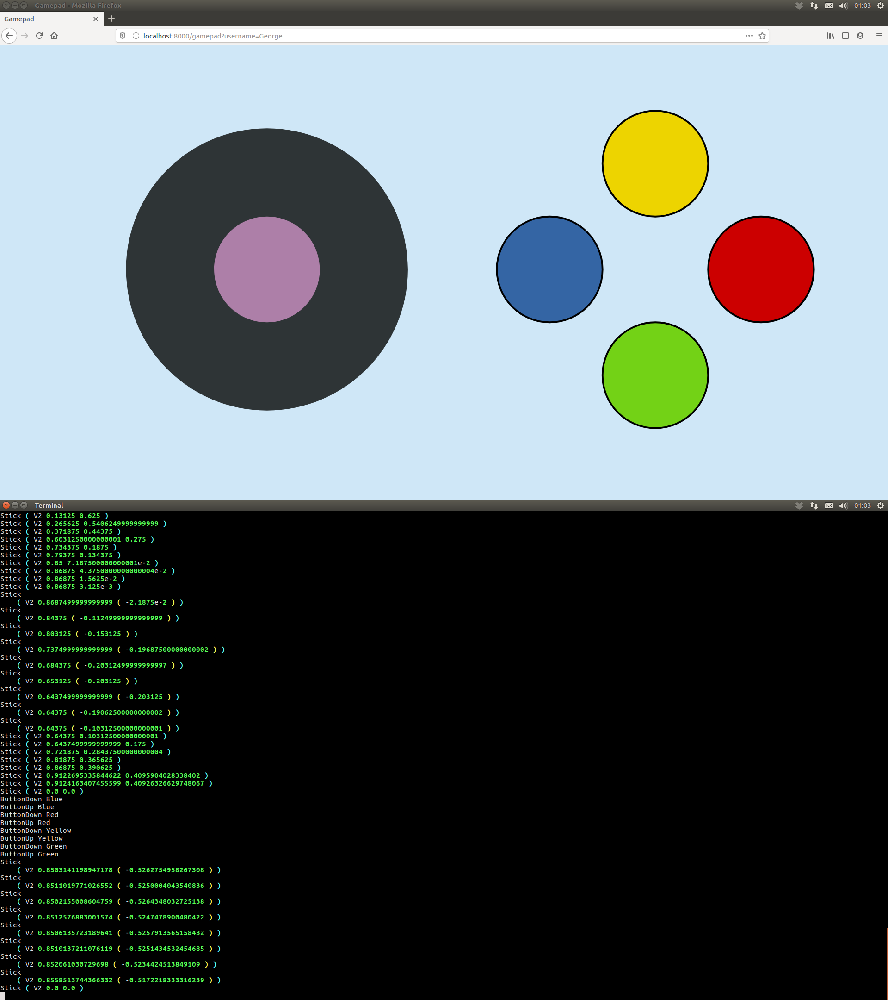

Prerequisites:
--------------

[Haskell](https://www.haskell.org/):
- `cabal-install` (often just referred to as 'cabal') ≥ 3.2
- `ghc` ≥ 8.10.1

[Elm](https://elm-lang.org/):
- `elm` ≥ 0.19.1

Build
------

If you haven't done so before, run `cabal update` to grab the latest package index from [hackage](https://hackage.haskell.org/).

Run `make` to create an executable in the `dist` folder. The first time you run this, it could take a while, as `cabal` will need to download and build all dependencies.

<!-- TODO readd 'advanced' section when development workflow has ossified -->

Run
---

Run the resulting executable to start the server (you can pass the `-h` flag to see all options). To access from an external device (eg. a phone, so that the controls actually work properly), you'll need to pass your IP address, since the default is `localhost`.

In a web browser, navigate to the address indicated in the terminal (eg. `http://localhost:8000/gamepad`).

Compatibility
-------------

Due to the use of some bleeding-edge features, at time of writing, the client only really works satisfactorily on Firefox Beta for Android:

- The *pointer events* API is unreliable in Chrome (offsets are reported wrong), and in beta in Firefox.
- Firefox does not currently give permission to switch to fullscreen on a change of rotation.
